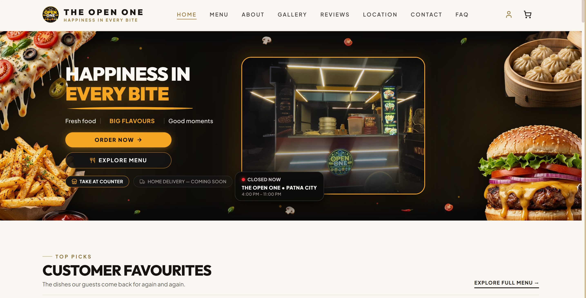
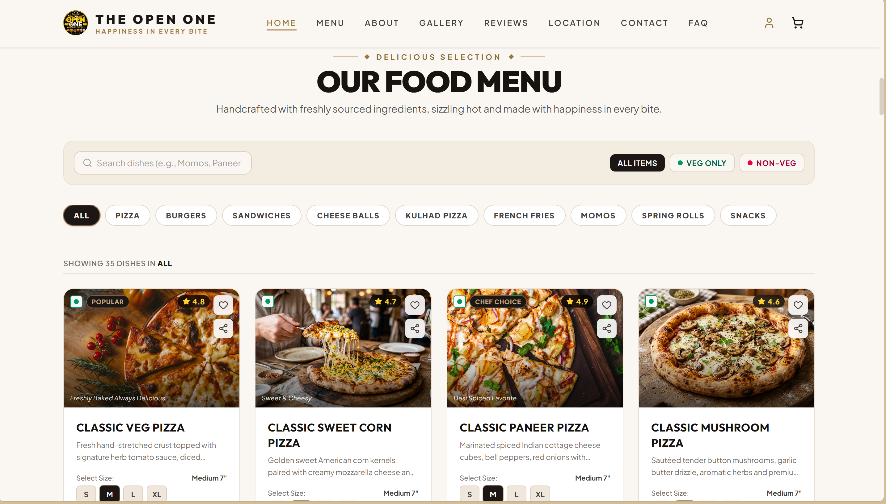
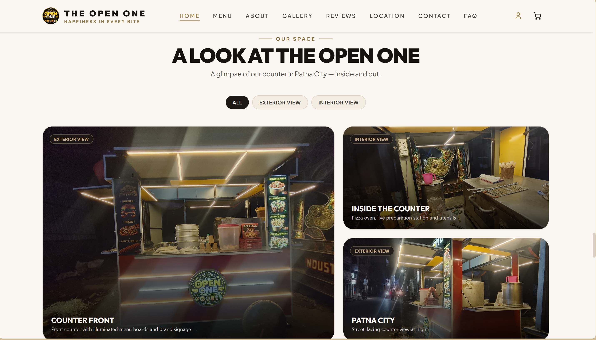
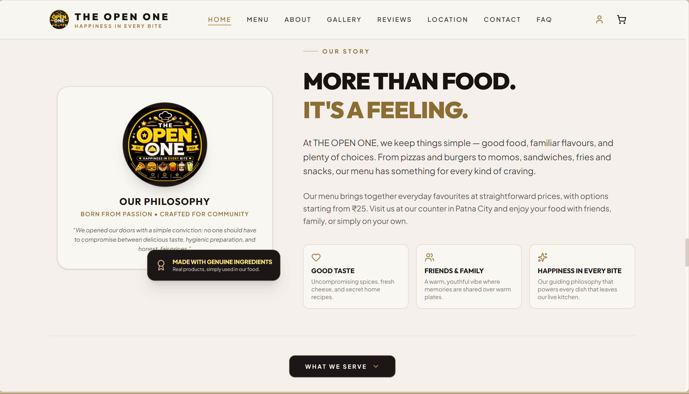

# THE OPEN ONE — Restaurant Website

A modern, responsive restaurant website designed and developed for **THE OPEN ONE**, a restaurant based in Patna, Bihar.

## 🌐 Live Website

**[Visit THE OPEN ONE](https://theopenone.vercel.app/)**

## ✨ Highlights

- Modern restaurant-focused UI/UX
- Responsive design for desktop, tablet, and mobile
- Restaurant menu and food presentation
- Customer reviews and ratings
- Contact and enquiry experience
- Progressive Web App (PWA) support
- SEO-ready structure
- Branded loading experience
- Responsive navigation and interactions
- Production deployment with Vercel

## 🛠️ Technology

- React
- TypeScript
- Vite
- Node.js
- Express
- Vercel

## 📱 Responsive Experience

The website is designed to provide a consistent experience across:

- Desktop
- Tablet
- Mobile

## 🏗️ Project Architecture

The production application uses a frontend + backend architecture.

This public repository is a **portfolio/showcase repository** containing selected public-facing assets and project configuration.

The production application source code and backend are maintained separately in a private repository because the website is used for a real business.

## 🚀 Deployment

The live production website is deployed on **Vercel**.

**Live:**  
https://theopenone.vercel.app/

## 📸 Website Preview

### 🏠 Homepage

### 🍕 Food Menu

### 📷 Gallery

### ❤️ About the Restaurant

## 👨‍💻 Developer

**Aditya Kumar**

GitHub: [@Adii-27](https://github.com/Adii-27)

---

> THE OPEN ONE — Restaurant Website  
> Designed and developed as a real-world web project.
